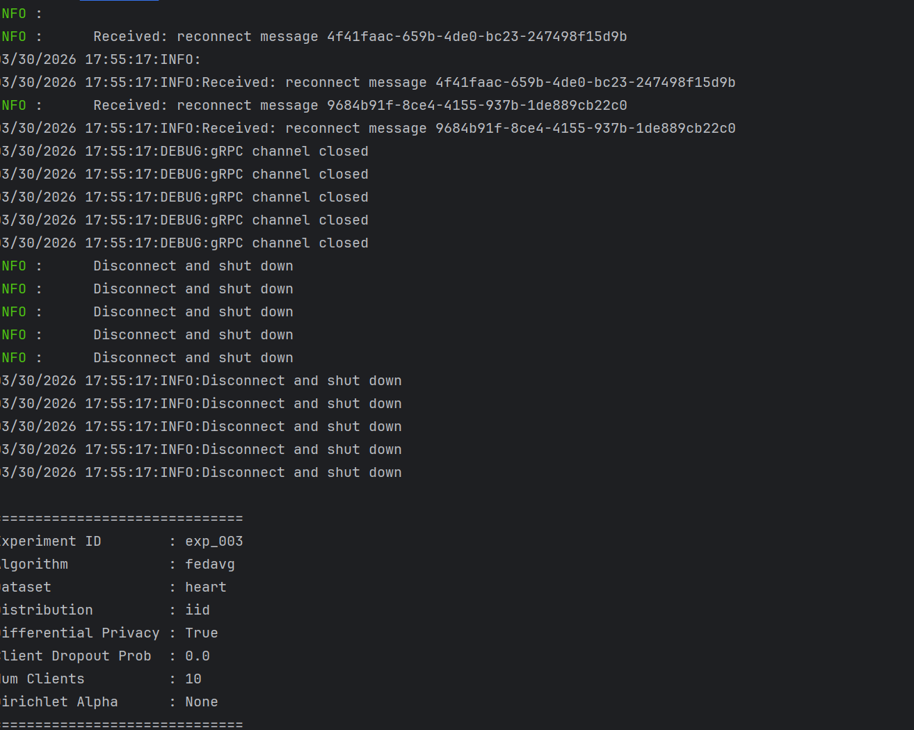
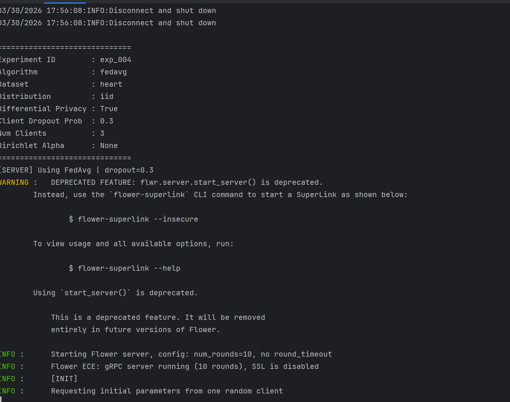
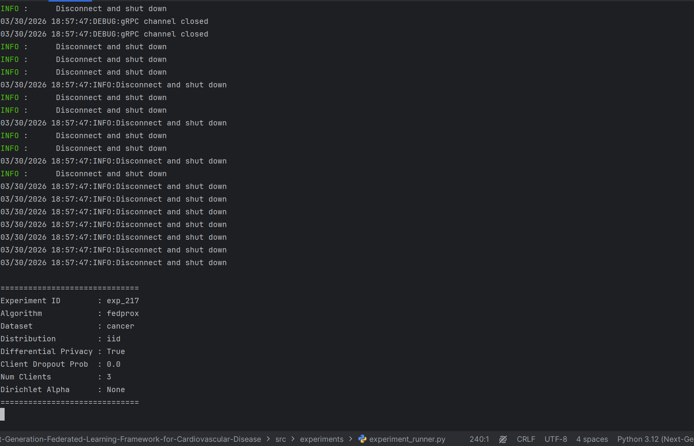
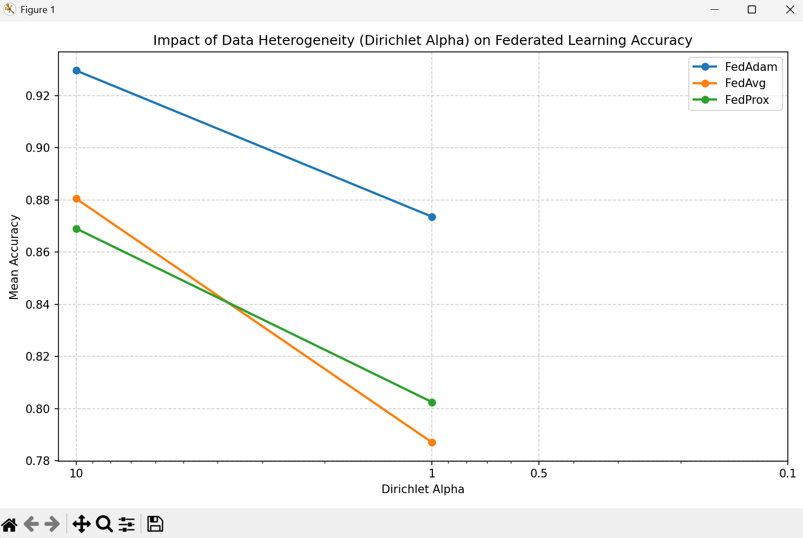
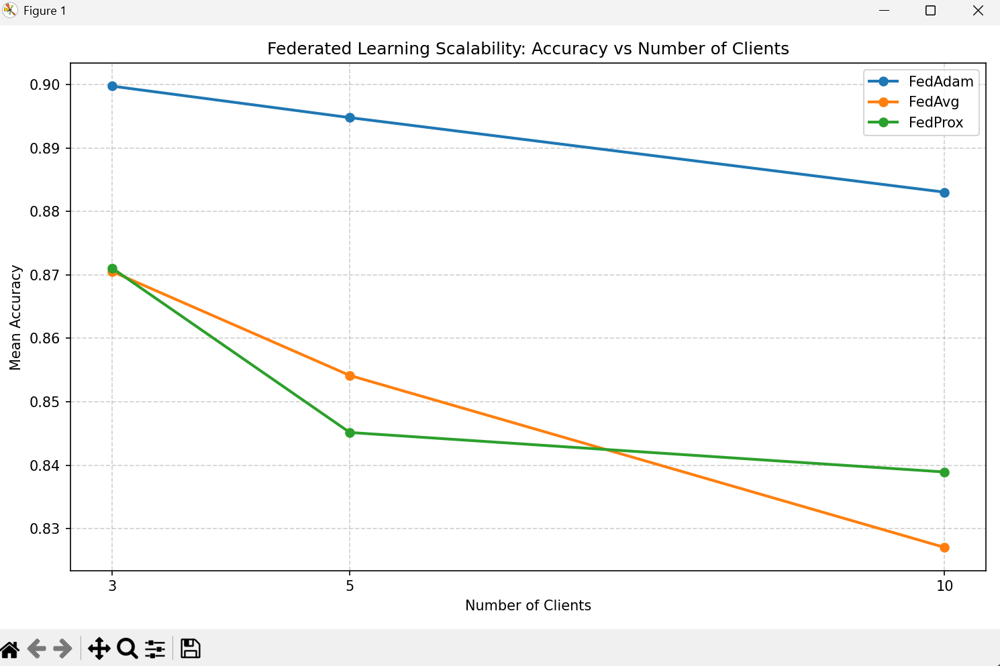
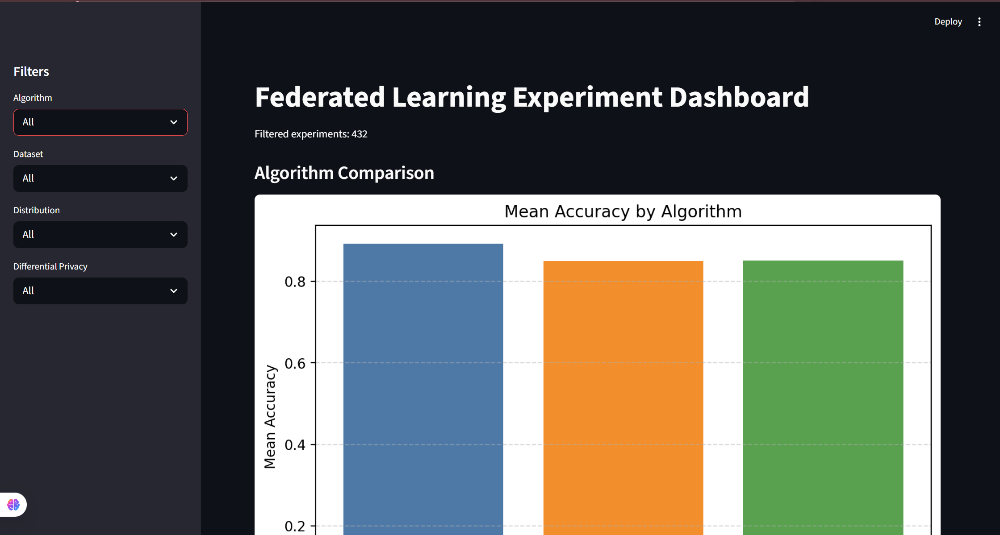
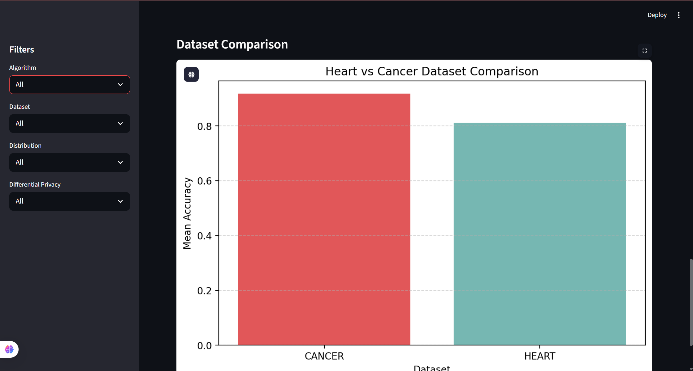
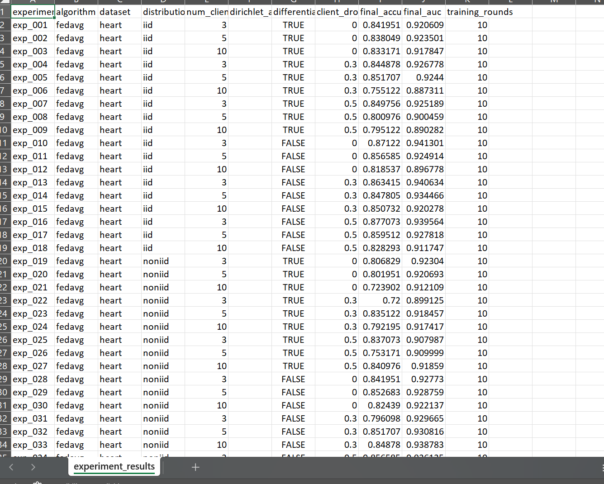

# Next-Generation Federated Learning Framework for Cardiovascular Disease Prediction

A research-oriented federated learning framework for healthcare datasets built with Flower and PyTorch. This project focuses on privacy-preserving distributed model training for cardiovascular disease prediction in distributed hospital environments, while supporting heterogeneous data distributions, differential privacy, client dropout simulation, scalability analysis, automated experiments, and result visualization.

---

## 1. Project Overview

Federated Learning (FL) is a distributed machine learning approach in which multiple institutions collaboratively train a shared global model without exchanging raw data. In healthcare, this is especially valuable because hospitals and medical centers often cannot directly share sensitive patient records due to privacy, regulatory, and ethical constraints.

This project simulates a realistic healthcare federated learning environment where multiple hospitals act as federated clients. Each client trains a local model on its own data and shares only model updates with a central server. The framework is designed for research experimentation and supports multiple federated optimization strategies, heterogeneous client data distributions, differential privacy, client dropout robustness, and scalability analysis.

---

## 2. System Architecture

The framework follows a server-client federated learning architecture:

- A central Flower server coordinates global training.
- Multiple simulated hospital clients train local PyTorch models.
- Raw patient data remains local to each client.
- Clients send only model parameters or updates to the server.
- The server aggregates updates using a selected federated learning strategy.
- The updated global model is redistributed in the next communication round.

### Federated Workflow

1. The server initializes the global model.
2. Clients receive the current global parameters.
3. Each client performs local training on its private dataset partition.
4. Clients send updated model parameters back to the server.
5. The server aggregates the updates using a selected FL algorithm.
6. Global performance is evaluated, logged, and stored for analysis.

---

## 3. Project Features

### Federated Learning Algorithms
- FedAvg
- FedProx
- FedAdam

### Data Distribution Settings
- IID partitioning
- Non-IID hospital-style partitioning
- Dirichlet-based heterogeneous partitioning

### Robustness Experiments
- Client dropout simulation during training rounds

### Privacy
- Differential Privacy using Opacus
- Gradient clipping
- Noise injection during local training

### Scalability Experiments
- Variable client counts
- Supported settings include 3, 5, and 10 clients

### Automated Experiment Pipeline
- Automated experiment runner
- CSV-based experiment logging
- Configurable experiment sweeps

### Visualization
- Convergence plots
- Accuracy vs Dirichlet alpha
- Accuracy vs number of clients
- Result comparison plots

### Interactive Dashboard
- Streamlit dashboard for experiment exploration and comparison

---

## 4. Project Structure

```text
Next-Generation-Federated-Learning-Framework-for-Cardiovascular-Disease/
│
├── dashboard.py
├── experiments_config.yaml
├── README.md
├── requirements.txt
├── results/
│   ├── experiment_results.csv
│   ├── convergence/
│   └── plots/
│
├── images/
│   ├── convergence.png
│   ├── alpha_plot.png
│   ├── clients_plot.png
│   └── dashboard.png
│
└── src/
    ├── centralized/
    ├── experiments/
    │   ├── experiment_client.py
    │   ├── experiment_runner.py
    │   ├── experiment_server.py
    │   ├── plot_convergence.py
    │   └── visualize_results.py
    │
    ├── federated/
    │   ├── server.py
    │   ├── dp_client0.py
    │   ├── dp_client1.py
    │   └── dp_client2.py
    │
    ├── models/
    │   └── heart_model.py
    │
    └── utils/
        ├── data_loader.py
        ├── data_partitioner.py
        └── plot_results.py
```

---

## 5. Installation

Clone the repository and install the required dependencies:

```bash
git clone <your-repository-url>
cd Next-Generation-Federated-Learning-Framework-for-Cardiovascular-Disease
pip install -r requirements.txt
```

### Main Technologies Used
- Flower
- PyTorch
- Opacus
- Streamlit
- Matplotlib
- Pandas
- PyYAML

---

## 6. Running Experiments

Install dependencies first:

```bash
pip install -r requirements.txt
```

Run the automated experiment framework:

```bash
python src/experiments/experiment_runner.py
```

This will:
- launch the federated server and clients
- run configured experiments
- log results across experiment settings
- save outputs into CSV files for analysis

---

## 7. Generate Plots

Run:

```bash
python src/utils/plot_results.py
```

This generates plots such as:
- accuracy vs Dirichlet alpha
- accuracy vs number of clients

Additional convergence visualizations can also be generated from the per-round experiment logs.

---

## 8. Launch Dashboard

Run the interactive dashboard using Streamlit:

```bash
streamlit run dashboard.py
```

The dashboard provides:
- algorithm comparison
- dataset comparison
- Dirichlet heterogeneity visualization
- client scalability analysis
- sidebar-based filtering for experiment exploration

---

## 9. Example Results

## Results

### Convergence / Training Behavior




---

### Effect of Data Heterogeneity (Dirichlet Alpha)


---

### Scalability (Clients vs Accuracy)


---

### Dashboard Visualization



---

### Experiment Results Table

---

## 10. Future Work

Potential future extensions include:

- support for additional medical datasets
- secure aggregation mechanisms
- asynchronous federated learning
- personalized federated learning approaches
- fairness-aware federated optimization
- deployment in real multi-institution healthcare environments

---

## 11. Contributors

- Amoghavarsha (22BCS009)
- B S Aathreya Sharma (22BCS024)
- Yellaling Kalyane (22BCS140)
- Bharath L (22BDS013)

